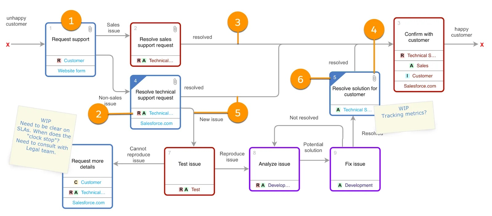
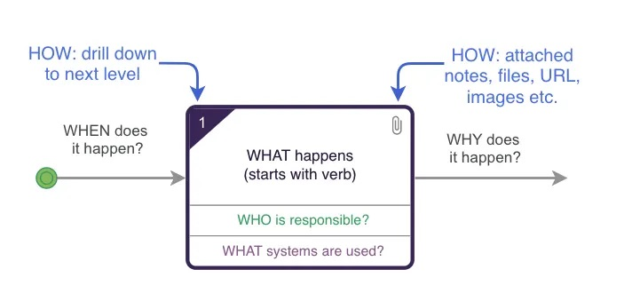

# DAO Process Mapping

## What is Process Mapping?

Creates a visual representation of business processes, its main purpose is to show the relationship between the steps and the inputs of a business to establish a clear, consistent, and concise result. It includes any activity that defines what a busines does, who is responsible for what, how standard business processes are completed, and how success is measured.

### The Purpose

Process maps help you look at existing workflows in a new way and help you keep your focus on strategic planning.

### Creating a Process Map

The diagram needs to be created so anyone in the business can understand it. It needs to show end-to-end activities, across departments, and can include external partners.

### Benefits

- Understanding and communicating the process easier 
- Help identify flaws in the process and where improvements should be made

## Universal Process Notation (UPN)

A UPN diagram: 
- Encapsulates every level of a process, from a top-level overview down to detailed, actionable diagrams.
- Can be viewed online
- Can  be created collaborativelly
- Can have a broad or narrow scope
- Supports regulatory and compliance considerations
- Provides contexts for metrics and management decisions

### Example

1. **Activity box:** a verb phrase labels each bo
2. **Resource:** a reource in each activity box designates the *who*. Tagged with either RACI (responsible, accountable, consulted, and informed) or more generally who is "supporting" the work.
3. **Line with text:** lines with text connect every activity box to another box and represent the handoff between steps.
4. **Attachment:** attachments provide documents, metadata, or metircs in the context of the process.
5. **Decision:** several lines coming out of an activity box with line text explaining the flow represent a decision
6. **Drill down:** any activity box can drill down to a lower-level diagram

### 5 Principles
1. No more than 8-10 activity boxes on a screen
2. Drill down from an activity box to a lower level to describe the detail
3. Attach supporting information to an activity box
4. View and edit controlleb by access rights
5. Version control and history changes at a diagram level

### Tools and Software

If you are relatively new to process mapping, it makes sense to create your process maps without any specialized software or extra expense for your org. Short list for helpful software:

- Drag-and-drop interface
- Formatting capabilities
- Security and versioning
- Publishing and sharing capabilities
- Intuitive design

## Process Mapping Steps

1. **Identify the process you need to map.** Determine the starting point. It can be an underperforming or a process with direct impact. 
2. **Identify the appropriate team.** The right team should include members who manage the process and can provide input about the process.
3. **Gather all necessary information.**
	1. Where does the process begin and end?
	2. What steps need to be taken between the beginning and the end?
	3. What are the inputs and outputs of the process?
	4. Who needs to do what and when do they need to do it?
4. **Develop the process map.** Draw the process with a focus on the order of the steps from beginning to end.
5. **Analyze the process map.** Scrutinize the process map to identify inefficiencies/bottlenecks. Ask yourself where can you make improvements or what steps can be removed.
6. **Develop new, better steps.** Begin with small steps and if you see improvements, try scaling to reach a broader audience.
7. **Manage the process.** Monitor performance and identify where it needs improvement.

### Best Practices

- **Apply process mapping to the right types of processes.** Decision making processes might not be the best because they are limited in steps and may not off the most impact.
- **Be clear about the focus of your process mapping.** Begin with the start and endpoints to help limit your scope. 
- **Get someone skilled to map your processes**
- **Validate your maps with key stakeholders.** Verify correctness.
- **Fully map first, as-is, and then fix processes**
- **Build the right team.** The people doing the processes day to day are the experts and they are critical input.
- **Keep it simple, it should be understandable to anyone in the org.**
- **Work with your stakeholders**

## The Impact

Process mapping gets everyone on the same page. The anaylsis reduces information silos, improves processes, reduces/elimates rework, improves adoption, and increases user engagement.

## References
1. [Business Process Mapping - Salesforce Trailhead](https://trailhead.salesforce.com/content/learn/modules/business-process-mapping?trailmix_creator_id=hanskam&trailmix_slug=business-analyst-2)
2. [Process Mapping for Business Analysts - Salesforce Trailhead](https://trailhead.salesforce.com/content/learn/modules/process-mapping-for-business-analysts)
